**Note:** The project may sound generic but it's an extensive implementation of a library and it's made considering a real life business case scenario, if you are still not convinced, then just have glance on this README file, I hope you will like it.


**This project was completed for the course CS-GY 6083 Principles of Database Systems at New York University by Puneeth Kotha, Jayraj Pamnani, and Ilka Jean as a part of the Course CSGY-6083 Principles of Database Systems.**

**The project's business case was provided by our Professor Amit Patel**

# Chapter - Library Management System

A comprehensive library management system built with Django, featuring book management, user management, and rental tracking capabilities.

## Features

- Book Management
  - Add, edit, and delete books
  - Track book details (title, author, ISBN, etc.)
  - Manage book categories and publishers

- Author Management
  - Maintain author profiles
  - Track author details and their books

- User Management
  - User registration and authentication
  - User profile management

- Rental System
  - Track book rentals
  - Manage rental history
  - Handle returns and due dates

- Publisher Management
  - Maintain publisher information
  - Track publisher's book catalog

- Category Management
  - Organize books by categories
  - Easy book categorization

- Study Room Reservations
  - Reserve and manage study rooms

- Event Management
  - Organize and register for seminars and events

- Admin Features
  - Dashboard and analytics

## Screenshots

## Relational Database Model of the Project
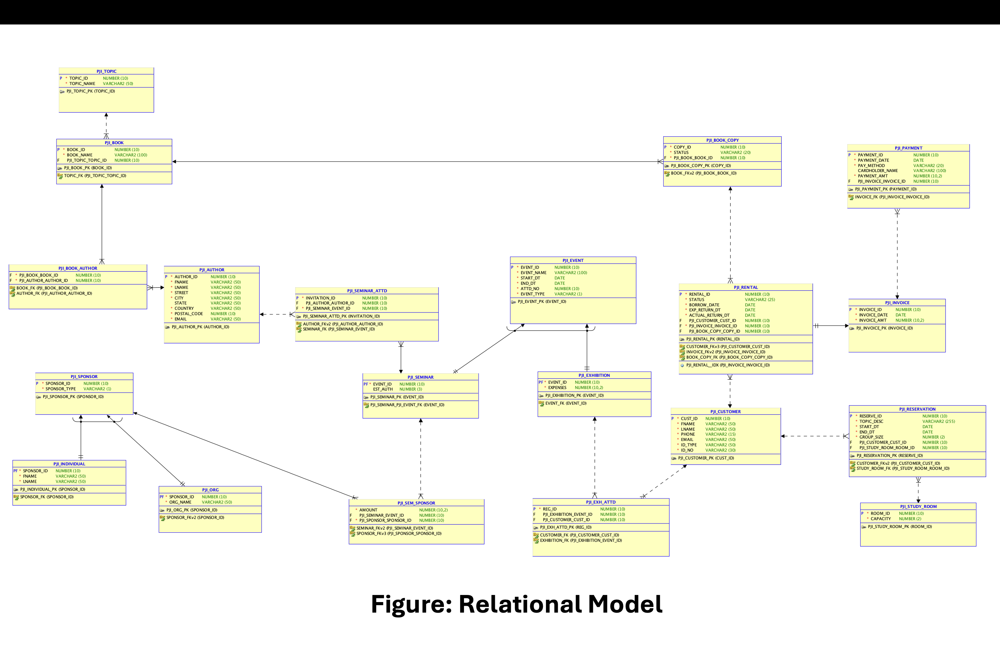

### User Interface
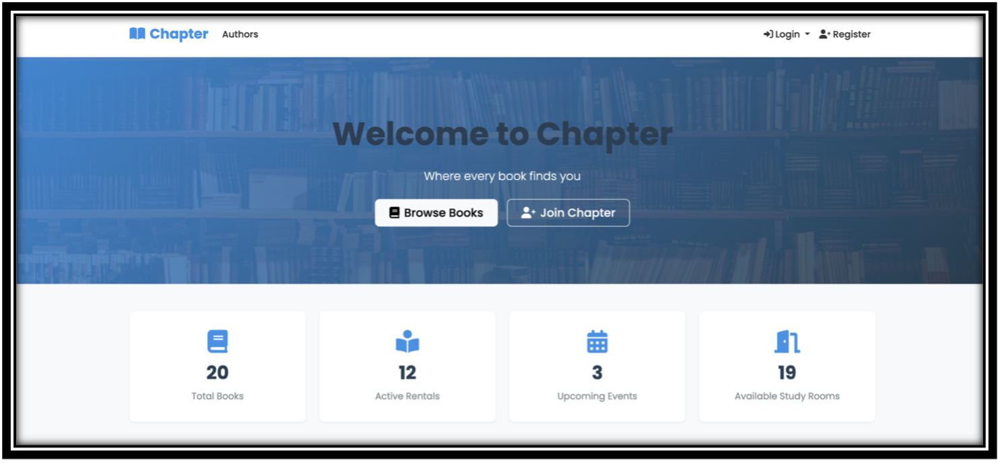
*Main homepage of the application*

### Authentication
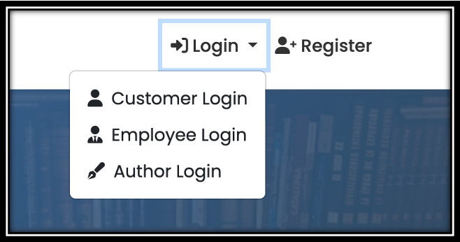
*Login options for different user types*

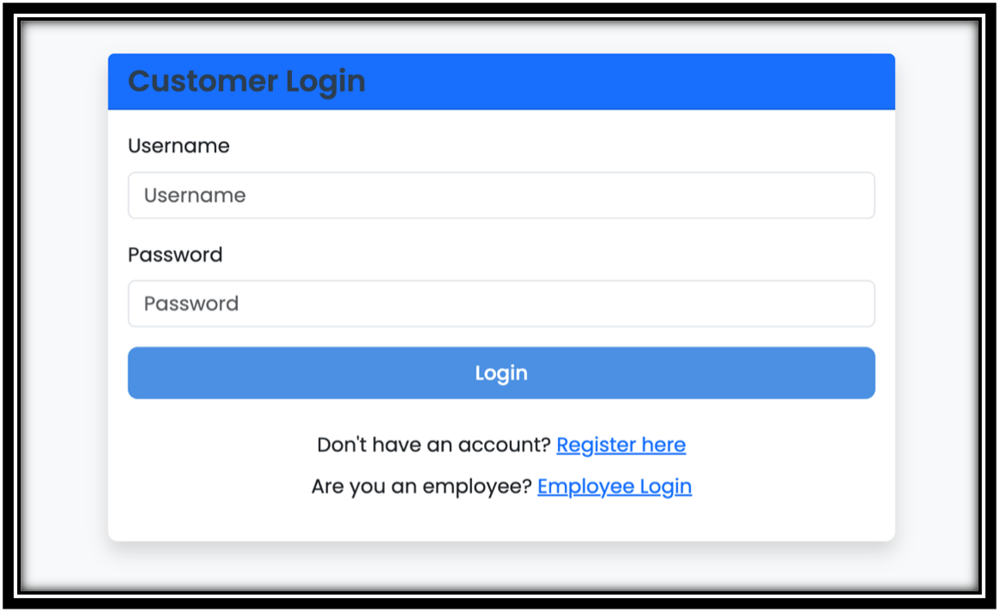
*Customer login page*

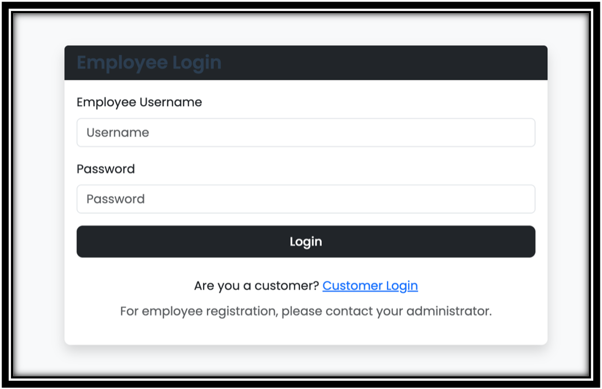
*Employee login page*

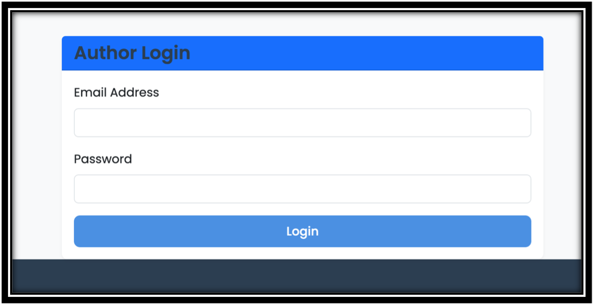
*Author login page*

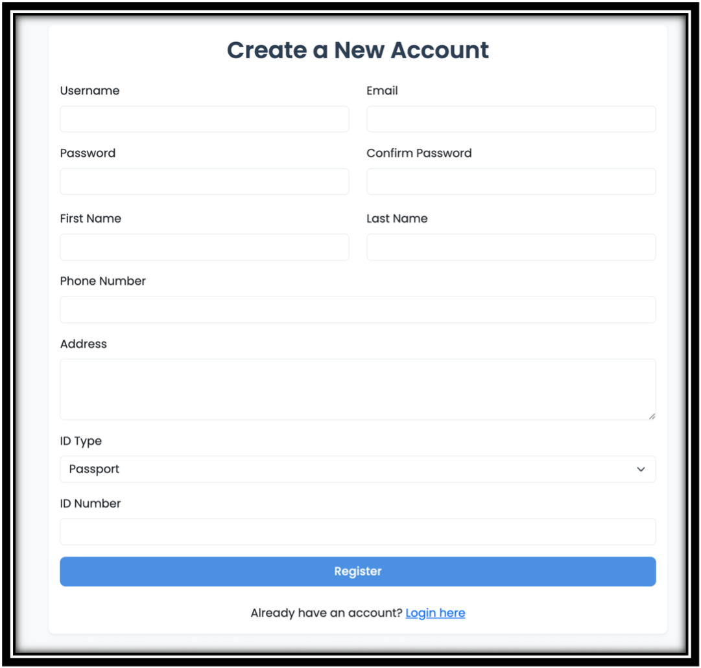
*New account creation page*

### Book Management
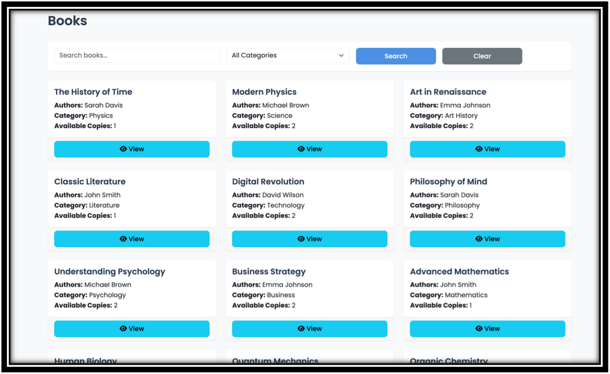
*List of available books*


*Books overview with copies count and authors*

### Study Room Management
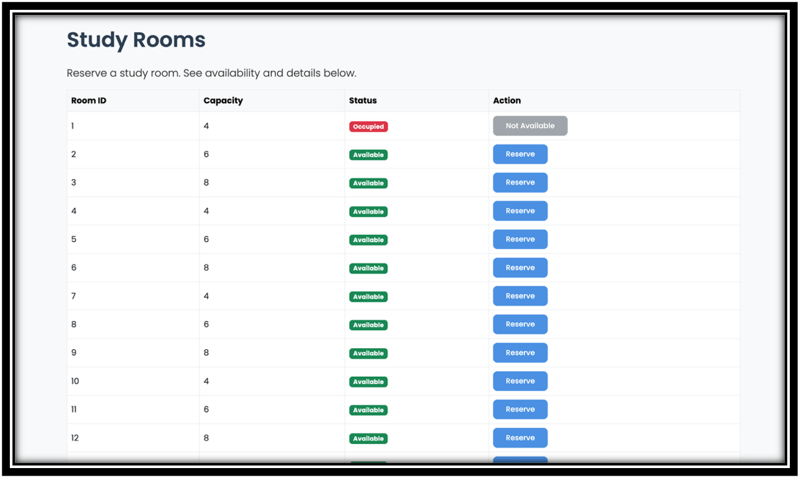
*Available study rooms*

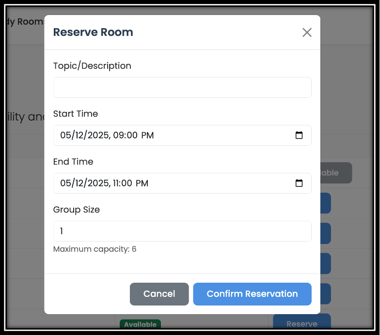
*Study room reservation form*

### Event Management
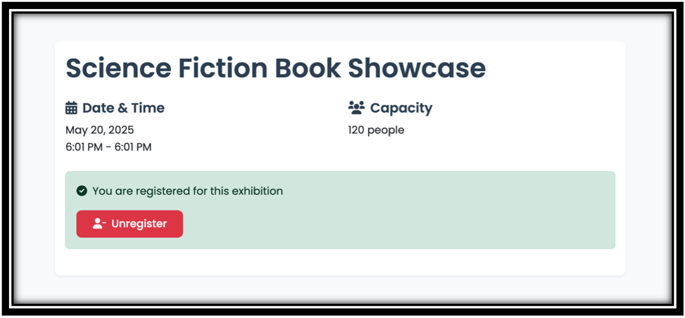
*Event registration confirmation page*

### Employee Dashboard

*Employee dashboard view*

### Rental Management

*List of books rented by customers*

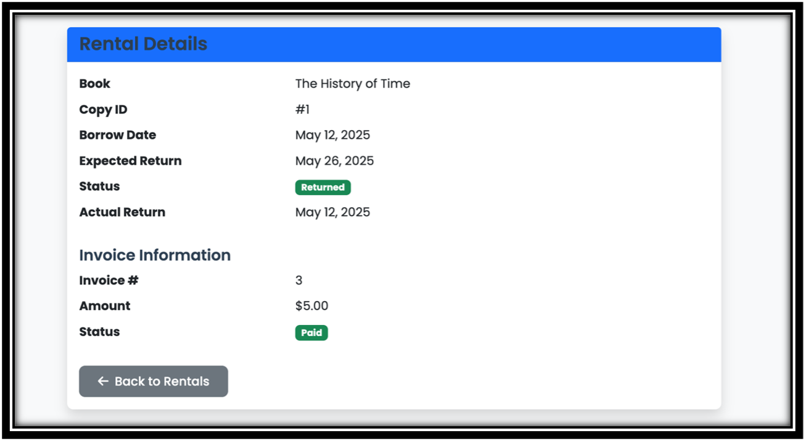
*Rental invoice*

## Installation

1. Clone the repository:
```bash
git clone https://github.com/yourusername/Chapter.git
cd Chapter
```

2. Create and activate a virtual environment:
```bash
python3 -m venv venv
source venv/bin/activate  # On Windows: venv\Scripts\activate
```

3. Install dependencies:
```bash
pip install -r requirements.txt
```

4. Set up the database:
```bash
python3 manage.py makemigrations
python3 manage.py migrate
```

5. Create a superuser:
```bash
python3 manage.py createsuperuser
```

6. Run the development server:
```bash
python3 manage.py runserver
```

7. Access the application:
- Main site: http://127.0.0.1:8000/
- Admin interface: http://127.0.0.1:8000/admin/

## Database Setup

The project includes SQL files for initial data population:

1. Run the migrations:
```bash
python3 manage.py migrate
```

2. Load the initial data:
```bash
python3 manage.py loaddata initial_data.json
```

## Contributing

1. Fork the repository
2. Create a new branch
3. Make your changes
4. Submit a pull request

## Contact

For any questions or concerns, please open an issue in the repository.

---


